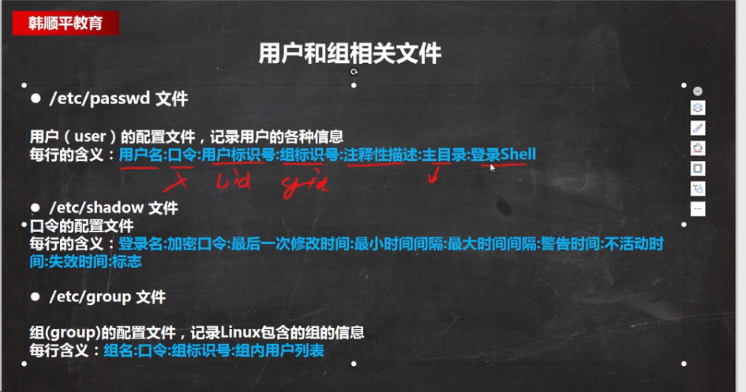

# su

> 用于切换当前用户身份到其他用户身份

## 语法

```bash
su [选项] (参数)
```

## 添加用户

```
useradd 用户名
```

## 更改密码

```
passwd 用户名
```

密码复杂度

```
sudo pam-auth-update
```

## 删除用户

```
userdel 用户名
```

删除家目录

```
userdel -r 用户名
```

## 切换用户

```
su - 用户名
```


# id

打印真实以及有效的用户和所在组的信息


```
id

uid=0(root) gid=0(root) groups=0(root)
```

查看当前用户

```
whoami
```

# 用户组

## groups

打印指定用户所在组的名称

### groupadd

用于创建一个新的工作组

```
 groupadd wudang
```

### groupdel

用于删除一个新的工作组

```
 groupdel wudang
```

新增用户直接添加组

```
groupadd wudang
useradd -g wudang zwj
```

### usermod

用于修改用户的基本信息

修改用户的组

```
usermod -g 组名 用户名
```

# 用户和组相关文件



  

```
server {
    listen 80;
    server_name 192.168.144.129;  # 例如：www.example.com 或 123.456.789.0
    
    # 前端静态文件路径
    root /var/www/ruoyi/dist;
    index index.html index.htm;
    
    # 处理 Vue 路由（SPA 应用）
    location / {
        try_files $uri $uri/ /index.html;
    }
    
    # 代理后端 API 请求（根据 RuoYi 的实际 API 路径配置）
    # RuoYi 通常使用 /api 或 /prod-api 作为前缀
    location /api/ {
        proxy_pass http://127.0.0.1:8080/;  # 将 /api/ 替换为 /
        proxy_set_header Host $host;
        proxy_set_header X-Real-IP $remote_addr;
        proxy_set_header X-Forwarded-For $proxy_add_x_forwarded_for;
        proxy_set_header X-Forwarded-Proto $scheme;
        proxy_connect_timeout 60s;
        proxy_send_timeout 60s;
        proxy_read_timeout 60s;
    }
    
    # 如果 RuoYi 使用 /prod-api 路径（常见于 RuoYi 框架）
    location /prod-api/ {
        proxy_pass http://127.0.0.1:8080/;
        proxy_set_header Host $host;
        proxy_set_header X-Real-IP $remote_addr;
        proxy_set_header X-Forwarded-For $proxy_add_x_forwarded_for;
        proxy_set_header X-Forwarded-Proto $scheme;
    }
    
    # 静态资源缓存（提高性能）
    location ~* \.(jpg|jpeg|png|gif|ico|css|js|svg|woff|woff2|ttf|eot)$ {
        expires 30d;
        add_header Cache-Control "public, immutable";
    }
    
    # 禁止访问隐藏文件
    location ~ /\. {
        deny all;
    }
    
    # 错误页面
    error_page 404 /404.html;
    error_page 500 502 503 504 /50x.html;
}
```

