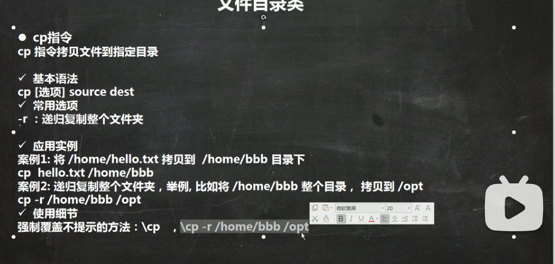

# 文件管理

## pwd

显示当前工作目录的绝对路径。

pwd（英文全拼：print working directory） 命令用于显示用户当前所在的工作目录（以绝对路径显示）。

## ls

显示目录内容列表

## cd

切换用户当前工作目录。

## cp

将源文件或目录复制到目标文件或目录中



## rm

用于删除给定的文件和目录

```
rm -rf /home/tom
```

## mv

用来移动文件或目录重新命名

# cat

查看多个文件并打印到标准输出。

```
cat -n /etc/profile
```

## more

显示文件内容，每次显示一屏

## less

分屏上下翻页浏览文件内容

## echo

输出指定的字符串或者变量

## head

显示文件的开头部分。

```bash
head -n 5 /etc/profile
```

## tail

在屏幕上显示指定文件的末尾若干行

```
tail -n 5 /etc/profile
```

## ln

用来为文件创建链接

# history

显示或操作历史列表。